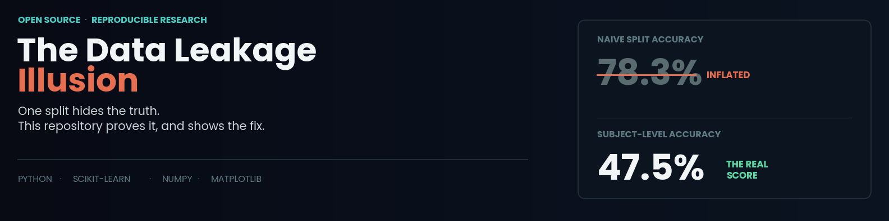

<div align="center">

# HAR Subject-Level Data Leakage Demo
**A reproducible case study in why a naive train/test split lets a model recognize the person instead of the activity, and what actually catches it.**

[](https://medium.com/@zainulabideen5/the-data-leakage-bug-that-makes-your-model-look-30-points-better-than-it-is-0160407cdaee?sharedUserId=zainulabideen5)
[](#)
[](#)
[](LICENSE)

</div>

> A model that hits 78% accuracy on activity recognition sounds solid. It isn't, not when the split let it memorize thirty people instead of learning four activities. The only way to know the difference is to stop trusting a single accuracy number and check what the split actually allowed the model to see.



---

## Why this exists

Subject-level data leakage is the default risk in almost any dataset built from repeated measurements of the same people: wearable sensors, medical imaging, biometric authentication, longitudinal studies. A plain random train/test split has no concept of "person," so it happily scatters one individual's samples across both sides of the split, handing a model the answer key before it's ever evaluated.

This repository is the full, reproducible proof of that claim. A synthetic 30-subject Human Activity Recognition dataset, a naive split that looks great and means nothing, the PCA embedding and confusion matrices that expose why, and the one-line group-aware fix. Every number in the article traces back to the code in this repo. Nothing here is illustrative or hand-picked.

---

## The finding, in one table

| Split | Random Forest | SVM |
|:--|:--:|:--:|
| Naive random split (leaked) | 78.3% | 77.2% |
| **Subject-level split (correct)** | **47.5%** | **54.0%** |
| Drop | −30.8 pts | −23.2 pts |

*Both models drop by roughly 25 to 30 accuracy points once the split stops letting them see each subject's data on both sides. Nothing about the model changed between these two numbers, only whether the split allowed it to cheat.*

---

## Repository structure

```
har-leakage-demo/
│
├── article.md                              Full write-up: reasoning, code, findings, checklist
├── README.md                               You are here
├── LICENSE                                 MIT
├── requirements.txt                        Exact dependencies to reproduce every result
│
├── src/
│   ├── generate_data.py                    Synthetic HAR dataset generator
│   ├── experiment.py                       Naive split vs. subject-level split experiment
│   ├── make_figures.py                     Builds all figures from real saved results
│   ├── make_banner.py                      Builds the Medium article banner
│   └── make_readme_banner.py               Builds this page's header image
│
├── results/
│   ├── results.json                        Accuracy + confusion matrices, both splits
│   └── dataset.npz                         The exact generated dataset (X, y, groups)
│
├── figures/
│   ├── readme_banner.png                   This page's header image
│   ├── figure1_split_diagram.png           Naive split vs. subject-level split, illustrated
│   ├── figure2_accuracy_comparison.png     The core result: accuracy, both splits, both models
│   ├── figure3_subject_vs_activity_embedding.png   PCA, colored by subject vs. by activity
│   └── figure4_confusion_matrices.png      Where the errors land, before and after the fix
│
└── assets/
    └── banner.png                          Cover image used in article.md and on Medium
```

---

## What's inside the dataset

A synthetic, fully reproducible stand-in for a wearable-sensor HAR problem, built entirely with NumPy so it needs no external download and runs in seconds:

| Property | Value |
|:--|:--|
| Subjects | 30 |
| Activities | 4 (walking, running, sitting, stairs) |
| Windows per subject per activity | 25 |
| Total samples | 3,000 |
| Features per window | 8 (sensor-style summary statistics) |
| Subject signature strength | Deliberately larger than the activity signal, matching real wearable sensor data |
| Seed | 42, fixed everywhere for exact reproducibility |

---

## The fix, isolated

```python
from sklearn.model_selection import GroupShuffleSplit

gss = GroupShuffleSplit(n_splits=1, test_size=0.2, random_state=42)
train_idx, test_idx = next(gss.split(X, y, groups))

# Turns "I think it's fine" into "it will crash if it isn't"
assert set(groups[train_idx]).isdisjoint(set(groups[test_idx])), "Leakage detected!"
```

One import, one extra argument passed to the split, and one assertion that turns a silent assumption into a loud failure the moment it's ever violated. No result in this repository is presented as a universal number to expect on every dataset, the point is the checking, not the specific accuracy drop.

---

## Reproduce it

```bash
git clone https://github.com/zain-ul-abideen-5036/har-leakage-demo.git
cd har-leakage-demo
python -m venv venv
source venv/bin/activate        # Windows: venv\Scripts\Activate.ps1
pip install -r requirements.txt

python -m src.experiment        # reproduces the 78.3% -> 47.5% result
python -m src.make_figures      # regenerates every figure from the real saved results
```

Every figure in `figures/` regenerates from `results/results.json` and `results/dataset.npz`, so the figures are never separated from the numbers that produced them.

Want to convince yourself this isn't a cherry-picked result? Change `seed` in `src/generate_data.py` and rerun both commands. The pattern holds across seeds, because it's structural, not incidental.

---

## Read the full write-up

The complete article, including the PCA visualization of why the subject signal dominates the activity signal, and the confusion-matrix breakdown of where the errors actually land once leakage is removed, lives in [`article.md`](article.md) in this repo as plain text, and is also published on Medium with every figure embedded inline.

<div align="center">

**[Read "The Data Leakage Bug That Makes Your Model Look 30 Points Better Than It Is" on Medium →](https://medium.com/@zainulabideen5/the-data-leakage-bug-that-makes-your-model-look-30-points-better-than-it-is-0160407cdaee?sharedUserId=zainulabideen5)**

</div>

---

## Why this matters beyond this one dataset

This case study generalizes directly to real research work involving repeated measurements from the same subjects: medical imaging where one patient contributes multiple scans, biometric datasets, longitudinal sensor studies. The habit this repository argues for, checking what a split actually allows a model to see before trusting its accuracy, is the same discipline behind catching validation-pipeline leaks and misaligned significance tests before they inflate a reported result anywhere else.

---

## License

Released under the [MIT License](LICENSE). Use the code freely. If you reference the article or its findings, an attribution back to this repository or the Medium piece is appreciated.

---

<div align="center">

## About the Author


### Zain Ul Abideen

</div>

I work at the intersection of applied machine learning and computer vision, mostly living in the space between a model that runs and a model that can be trusted. That usually means chasing down the quiet failure modes that a headline metric hides: data leakage, mismatched validation splits, and, as this repository shows, an accuracy number that looks great and means nothing.

I graduated in Computer Science from the University of Central Punjab, Lahore, with a minor in AI, ML, and Deep Learning, and I currently work as a Lead AI/ML Instructor while holding a Senior Microsoft Learn Student Ambassador (Gold) role. Alongside that, I take on applied ML engineering work for external clients and collaborate on graduate-level research, most recently redesigning the validation methodology and statistical testing for an MSc dissertation on deep transfer learning.

This repository is part of a broader, ongoing body of public research work: reproducible case studies, each one built to be run, questioned, and verified rather than taken on faith. Every piece follows the same rule this one does: if the honest result is a smaller number than expected, that stays in, because that's usually the more useful finding.

<br/>

<div align="center">

[](https://github.com/zain-ul-abideen-5036)
[](https://linkedin.com/in/zain-ul-abideen3)

<br/>

*If this repository helped you catch a leaked split, a star is the best kind of feedback.*

</div>
