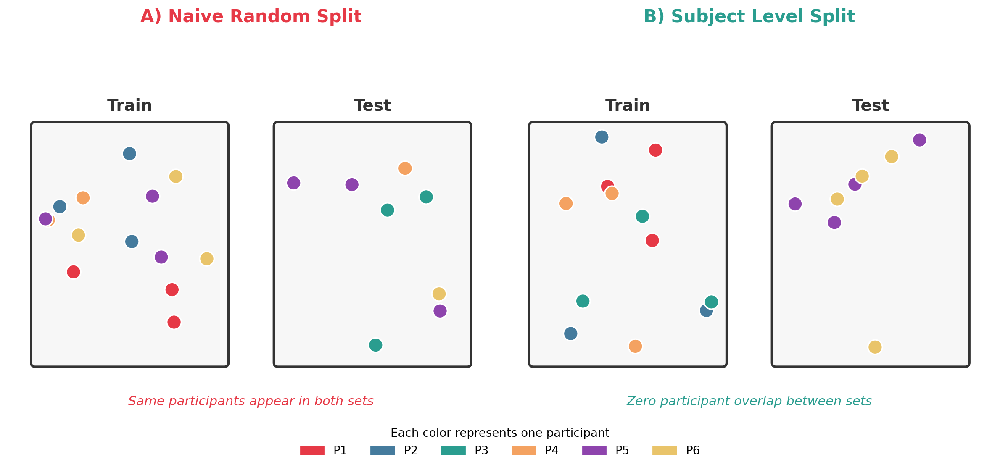
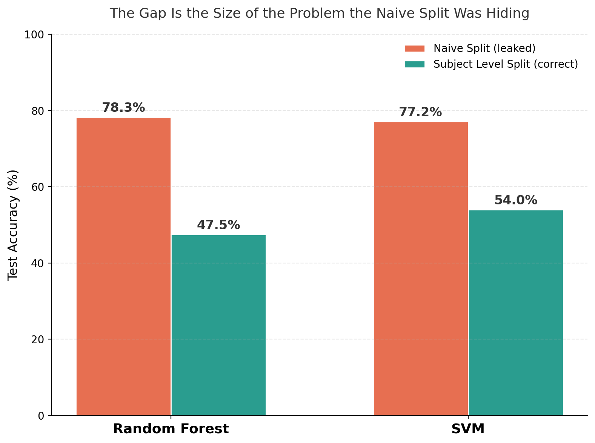

# The Data Leakage Bug That Makes Your Model Look 30 Points Better Than It Is

I built a simple activity classifier, the kind that recognizes walking, running, sitting, and climbing stairs from wearable sensor data, and it hit 78% accuracy on the first try. Then I changed one thing about how I split the data into train and test sets, reran the exact same model, and watched it fall to 47%.

Same data. Same model. Same code, minus four lines. A 30 point swing, and the lower number was the true one.

This is one of the most common and most silent bugs in applied machine learning, and it shows up constantly in Human Activity Recognition (HAR), the field built around teaching models to recognize physical activity from wearable sensors. In this article I will walk through exactly what the bug is, why it hides so well, and the full working fix. Every number here comes from code you can run yourself. Nothing is illustrative or hypothetical.

> The full, runnable code behind every number and figure in this article lives in a small open repository: **[github.com/zain-ul-abideen-5036/har-leakage-demo](https://github.com/zain-ul-abideen-5036/har-leakage-demo)**. Clone it and run it alongside this article if you want to verify anything as you read.

---

<p align="center">
  
</p>

---

## The setup

Picture a typical wearable sensor dataset. A few dozen people, each wearing an accelerometer, each performing several activities in turn: walking, running, sitting, climbing stairs. The sensor doesn't record one number per person. It records continuously, and researchers slice that stream into short overlapping windows, so each person ends up contributing hundreds of individual samples to the dataset.

Once you have that pile of samples, the standard, almost automatic next step looks like this:

```python
from sklearn.model_selection import train_test_split

X_train, X_test, y_train, y_test = train_test_split(
    X, y, test_size=0.2, random_state=42, shuffle=True
)
```

If you've written more than a handful of machine learning pipelines, this line is completely unremarkable. That is exactly the problem. It is quietly, confidently wrong for this kind of data, and the reason why is the entire point of this article.

---

## Why this is wrong, and why nobody notices

The dataset is not really "a pile of independent samples." It is thirty people, each contributing hundreds of correlated samples. Every person moves in their own particular way: a certain stride length, a certain arm swing, a certain rhythm to how their foot hits the ground. That personal signature shows up in the sensor readings for every activity they do, not just one.

A random shuffle has no idea any of that matters. It happily places some of Subject 14's walking windows into the training set and other windows from Subject 14, sometimes captured only seconds apart, into the test set.

So the model doesn't strictly need to learn what walking looks like in general. It can partially get away with recognizing Subject 14 specifically, and it has already met Subject 14 during training. The model isn't cheating on purpose. The split simply handed it the answer key before the exam started.

---

<p align="center">
  
</p>

<p align="center">
  <strong>Figure 01.</strong> Naive random split vs. subject level split, side by side
</p>

---

This isn't a hypothetical concern I'm raising to sound careful. It's a documented, recurring finding in real HAR research. One comparative study running a Random Forest model on real wearable sensor data found that switching from standard k fold cross validation to Leave One Subject Out validation, the rigorous approach, dropped the reported accuracy from <cite index="3-1">89% down to 76%</cite>. That's the same pattern this article reproduces, appearing independently in someone else's real dataset. It isn't a coincidence. It's the same bug, caught twice.

---

## Reproducing it, with full code

To make this concrete rather than theoretical, here is a self contained simulation you can run yourself. It builds a synthetic but structurally realistic HAR dataset: 30 subjects, 4 activities, 8 sensor style summary features per window, where each subject carries their own "movement signature" baked directly into the data, the same way a real accelerometer dataset would.

```python
import numpy as np

rng = np.random.RandomState(42)

N_SUBJECTS = 30
ACTIVITIES = ["walking", "running", "sitting", "stairs"]
N_CLASSES = len(ACTIVITIES)
WINDOWS_PER_SUBJECT_PER_CLASS = 25
N_FEATURES = 8

# The true, class discriminative signal: what we actually want the model to learn
class_centers = rng.normal(0, 1.0, size=(N_CLASSES, N_FEATURES))

# Each subject's idiosyncratic movement signature. In real sensor data this
# is often larger than the activity signal itself, which is exactly what
# makes it dangerous.
subject_signatures = rng.normal(0, 2.2, size=(N_SUBJECTS, N_FEATURES))

X, y, groups = [], [], []
for subj in range(N_SUBJECTS):
    for cls in range(N_CLASSES):
        for _ in range(WINDOWS_PER_SUBJECT_PER_CLASS):
            noise = rng.normal(0, 1.0, size=N_FEATURES)
            X.append(class_centers[cls] + subject_signatures[subj] + noise)
            y.append(cls)
            groups.append(subj)

X, y, groups = np.array(X), np.array(y), np.array(groups)
```

Here is the naive split. This is the bug, written out plainly:

```python
idx = np.arange(len(X))
np.random.RandomState(7).shuffle(idx)
split = int(len(idx) * 0.8)
train_idx, test_idx = idx[:split], idx[split:]
# Subject identity was never considered here. Leakage is guaranteed.
```

And here is the fix: a group aware split, plus the one line that actually protects you from ever shipping this bug again.

```python
from sklearn.model_selection import GroupShuffleSplit

gss = GroupShuffleSplit(n_splits=1, test_size=0.2, random_state=42)
train_idx, test_idx = next(gss.split(X, y, groups))

# This assertion turns "I think it's fine" into "it will crash if it isn't"
assert set(groups[train_idx]).isdisjoint(set(groups[test_idx])), "Leakage detected!"
```

Training a Random Forest and an SVM on both versions of the split produces a clear, consistent gap.

---

<p align="center">
  
</p>

<p align="center">
  <strong>Figure 02.</strong> Accuracy comparison, naive split vs. subject level split, both models
</p>

---

Random Forest goes from 78.3% down to 47.5%. SVM goes from 77.2% down to 54.0%. Both models drop by roughly 25 to 30 accuracy points. Nothing about the model architecture, the hyperparameters, or the training procedure changed between these two numbers. Only whether the split allowed the model to cheat changed.

---

## Why the drop is this large

It helps to actually look inside the feature space rather than just trust the accuracy numbers. Running PCA on the same dataset and coloring points by subject identity versus coloring them by activity class makes the underlying problem visible directly.

---

**[Insert Figure 3 here — PCA embedding, colored by subject identity vs. colored by activity class]**

---

Colored by subject, the points form tight, cleanly separable clusters. Colored by activity class, the four classes overlap heavily and blend into each other. This is the mechanism in a single picture: the signal that best explains the variation in the data is who the person is, not what they're doing. A naive split lets the model quietly optimize for the easier, wrong signal, and the accuracy number has no way of telling you that's what happened.

---

## Where the errors land once the leakage is gone

Removing the leakage doesn't just lower the headline accuracy number, it changes what kind of mistakes the model makes. Looking at the confusion matrix before and after the fix shows this clearly.

---

**[Insert Figure 4 here — Confusion matrices, naive split vs. subject level split]**

---

Under the naive split, the Random Forest is confidently correct almost everywhere, with errors scattered lightly and evenly. Under the subject level split, the errors concentrate heavily around specific activity pairs, most noticeably confusing walking, running, and stairs with each other, activities that genuinely do share overlapping physical signatures. That's a far more honest picture of the problem. A model that struggles specifically to separate walking from stairs is telling you something real about the task's difficulty. A model that simply memorized thirty people was never telling you anything about the task at all.

---

## The part that should genuinely concern you

The subject signature in this simulation was deliberately set larger than the activity signal, and that is not an exaggeration for effect. In real wearable sensor data, individual differences in how people move frequently do dominate over the activity class signal itself. That's precisely why Leave One Subject Out evaluation is the standard recommended protocol in HAR research rather than an optional extra step. A model that looks impressive under a naive split can be doing almost nothing but person recognition underneath, and the only way to find out is to check.

---

## A checklist so you don't find this the hard way

If your dataset has any natural grouping at all, the same person, patient, device, or session contributing more than one sample, check these before you trust a single accuracy number:

- Does the train and test split know about groups, or is it shuffling blind
- Is the split using GroupShuffleSplit, GroupKFold, or Leave One Subject Out, instead of a plain random split
- Is there an explicit assertion checking for zero overlap between train and test groups
- Would the reported accuracy survive a stranger rerunning the split from scratch, with no shortcuts

It costs one import, one extra argument, and one assertion. It's also the entire difference between a model that actually works and a model that has simply memorized who it already met.

---

## Try it yourself

Every number and figure in this article comes from code you can run in a few minutes, not a black box.

**Repository:** [github.com/zain-ul-abideen-5036/har-leakage-demo](https://github.com/zain-ul-abideen-5036/har-leakage-demo)

```bash
git clone https://github.com/zain-ul-abideen-5036/har-leakage-demo.git
cd har-leakage-demo
pip install -r requirements.txt
python -m src.experiment      # reproduces the 78.3% -> 47.5% result
python -m src.make_figures    # regenerates every figure in this article
```

Change the random seed in `src/generate_data.py` and rerun both commands if you want to convince yourself this isn't a cherry picked result. It holds across seeds, because it's structural, not incidental.

If this kind of methodology first debugging is interesting to you, the repository's README has more detail, and I'm always happy to talk shop in the comments.
